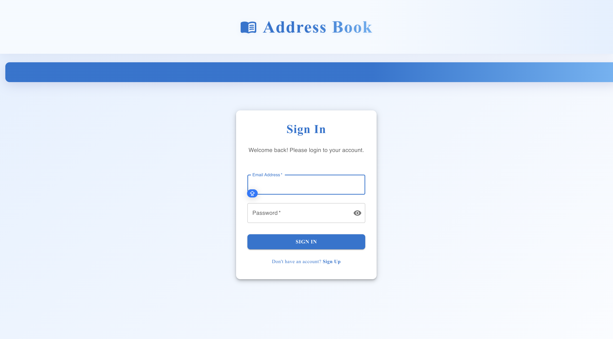
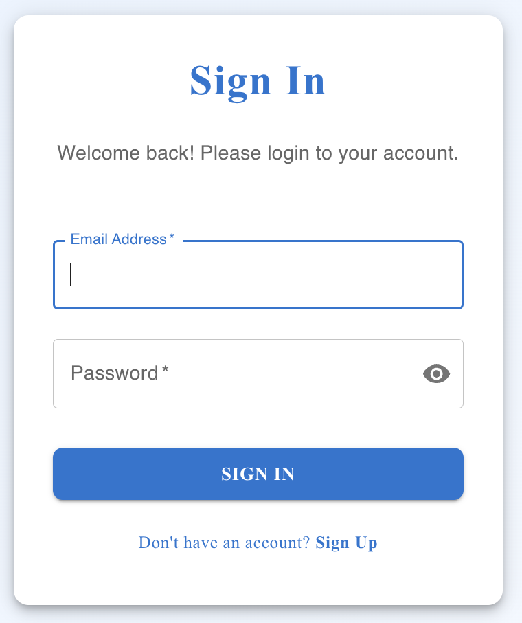
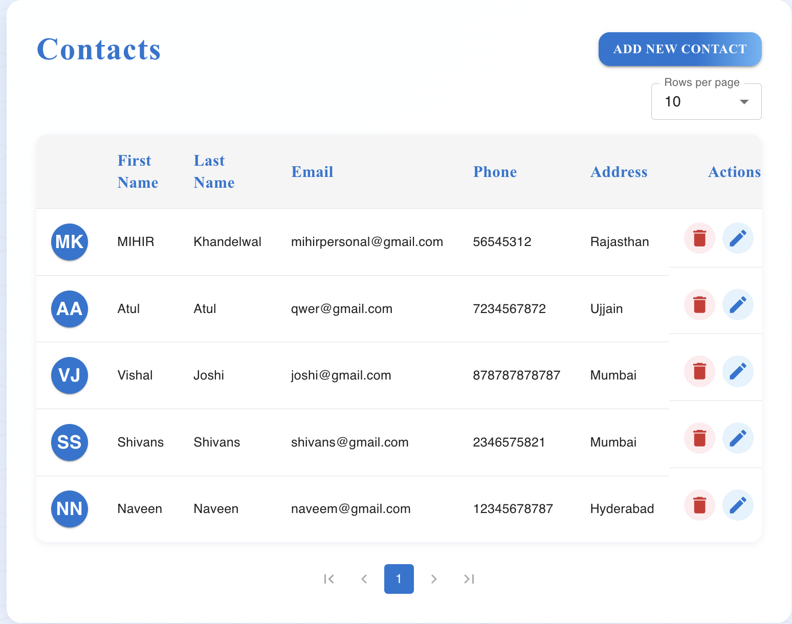
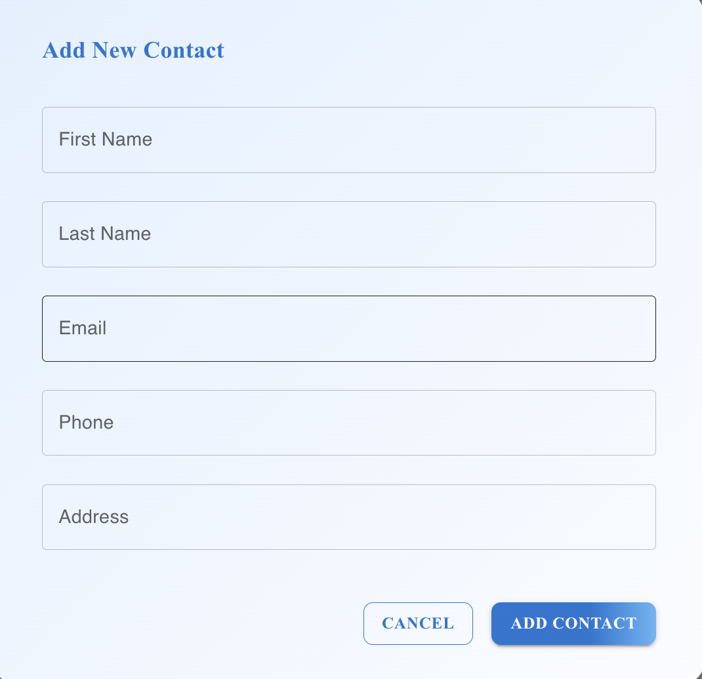

# Address Book Application



A full-stack Address Book web application built with React (frontend) and FastAPI (backend). This app allows users to manage their contacts with features like add, edit, delete, search, and pagination.

---

## Features

- User authentication with JWT (token-based)
- Add, edit, and delete contacts (CRUD)
- Responsive and modern UI using Material-UI (MUI)
- Pagination and rows-per-page selection
- Duplicate email/phone validation
- Search and filter contacts (if implemented)
- Avatar initials for contacts
- Error handling and form validation
- Protected routes (only logged-in users can access contacts)
- Logout functionality
- PostgreSQL database (backend)
- Input validation (backend and frontend)
- Swagger documentation (backend)

---

## Tech Stack

### Frontend

- [React](https://react.dev/)
- [TypeScript](https://www.typescriptlang.org/)
- [Material-UI (MUI)](https://mui.com/)
- [React Router](https://reactrouter.com/)
- [Axios](https://axios-http.com/) (for API requests)
- [Vite](https://vitejs.dev/) (for fast development)

### Backend

- [FastAPI](https://fastapi.tiangolo.com/)
- [SQLAlchemy](https://www.sqlalchemy.org/)
- [Pydantic](https://pydantic.dev/)
- [PostgreSQL](https://www.postgresql.org/)
- [Uvicorn](https://www.uvicorn.org/) (ASGI server)
- JWT authentication

---

## Folder Structure

```
V_A/
├── frontend/
│   ├── src/
│   │   ├── components/
│   │   │   ├── Layout.tsx
│   │   │   └── Contacts.tsx
│   │   ├── services/
│   │   │   └── api.ts
│   │   ├── images/
│   │   │   ├── banner.png
│   │   │   ├── login.png
│   │   │   ├── register.png
│   │   │   └── contacts.png
│   │   └── App.tsx
│   └── ...
├── backend/
│   └── ... (backend code)(Fast Api and rest other)
└── README.md
```

---

## Prerequisites

- Node.js (v18+ recommended)
- npm or yarn
- Python 3.8+
- PostgreSQL
- pip (Python package manager)

---

## Getting Started

### Backend Setup

1. **Create a virtual environment:**
   ```sh
   python -m venv venv
   source venv/bin/activate  # On Windows: venv\Scripts\activate
   ```

2. **Install dependencies:**
   ```sh
   pip install -r requirements.txt
   ```

3. **Create a `.env` file in the backend directory:**
   ```
   POSTGRES_SERVER=localhost
   POSTGRES_USER=postgres
   POSTGRES_PASSWORD=your_password
   POSTGRES_DB=addressbook
   ```

4. **Create the database:**
   ```sh
   createdb addressbook
   ```

5. **Run the backend:**
   ```sh
   uvicorn app.main:app --reload
   ```
   The API will be available at `http://localhost:8000`

---

## Frontend Setup

1. **Install dependencies:**
   ```sh
   cd frontend
   npm install
   
   ```

2. **Configure API endpoint:**
   - Edit `frontend/src/services/api.ts` and set the correct backend API base URL.

3. **Run the frontend:**
   ```sh
   npm run dev
   
   ```

4. **Access the app:**  
   Open [http://localhost:5173](http://localhost:5173) in your browser.

---

## Usage

1. **Login:**  
   Enter your credentials to log in. (Registration flow depends on backend.)

   

2. **Register:**  
   Create a new account if you don't have one.

   

3. **Manage Contacts:**  
   - Click "Add New Contact" to create a contact.
   - Edit or delete existing contacts using the action buttons.
   - Use pagination controls to navigate through contacts.
   - Select rows per page as needed.

   
   
    

4. **Logout:**  
   Use the logout button in the header to securely log out.

---

## API Documentation

Once the backend is running, you can access:
- Swagger UI: `http://localhost:8000/docs`
- ReDoc: `http://localhost:8000/redoc`

---

## API Endpoints

### Authentication
- POST `/api/auth/register` - Register a new user
- POST `/api/auth/token` - Login and get access token

### Contacts
- GET `/api/contacts` - List all contacts
- POST `/api/contacts` - Create a new contact
- GET `/api/contacts/{contact_id}` - Get a specific contact
- PUT `/api/contacts/{contact_id}` - Update a contact
- DELETE `/api/contacts/{contact_id}` - Delete a contact

---

## Security

- All endpoints except registration and login require authentication
- Passwords are hashed using bcrypt
- JWT tokens are used for authentication
- Input validation is performed using Pydantic (backend) and form validation (frontend)

---

## Customization

- **Theme:**  
  Modify MUI theme in `frontend/src/theme.ts` (if present).

- **Validation:**  
  Adjust validation logic in `Contacts.tsx` as needed.

- **Backend:**  
  Swap out backend stack as required; update API calls in `api.ts`.

---

## Troubleshooting

- **CORS errors:**  
  Ensure your backend allows requests from the frontend origin.

- **API errors:**  
  Check backend logs and ensure endpoints match frontend expectations.

- **Token issues:**  
  Make sure tokens are stored and sent correctly in API requests.

---

## License

MIT License

---

## Author

- [Your Name](https://github.com/rivshr27)
- [Project Repository](https://github.com/rivshr27address-book)

---

## Screenshots

> Add more screenshots of your app here for better documentation.

---

## Acknowledgements

- [Material-UI](https://mui.com/)
- [React](https://react.dev/)
-